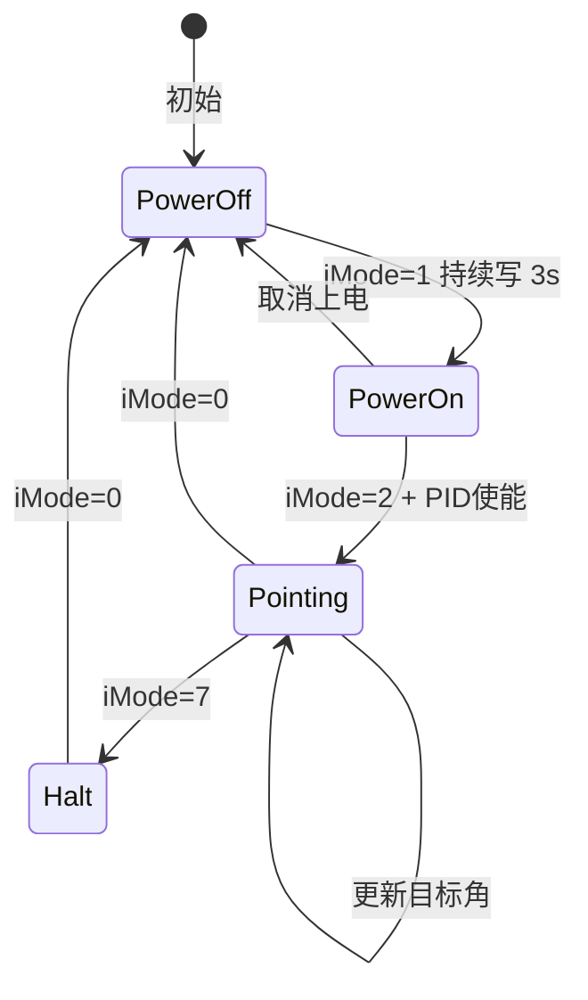

# ACU 远控 Modbus TCP 接口规范

> **文档用途**：供另一项目（或 AI 助手）实现 ACU/上位机主站，通过 Modbus TCP 控制本天线 PLC。  
> **权威来源**：PLC 程序 `plc-src/Device/Application/Modbus_Slave.txt`、`SecurityCheck.txt`、各轴 `*_ctrl_1.txt`；Python 参考实现 `scripts/modbus_plc_codec.py`。  
> **验证状态**：本项目 Web 上位机（`modbus_web_app.py`）与 CLI 模拟器（`modbus_host_sim.py`）已在实机验证上电/指向/Halt/下电可用。  
> **最后整理**：2026-06-05

---

## 0. AI 快速索引（读本文档时的检索锚点）

| 关键词 | 章节 |
|--------|------|
| IP/端口/Unit ID | §1 |
| 轴映射 Axis1/2/3 vs Az/El/Ti | §2 |
| iMode 0/1/2/3/4/7 | §3 |
| HR 寄存器表 | §4 |
| HR[7] PID/控制位 | §4.2 |
| 角度 DINT 编码公式 | §5 |
| UTC / 轨道表 / 程引 | §6 |
| IR 反馈解析 | §7 |
| 指向模式完整流程 | §8 |
| 程引回放 | §9 |
| 仅倾斜轴写 HR | §10 |
| 前置条件 bLocalCtrl | §11 |
| 故障码 / 限位 | §12 |
| 多主站冲突 | §13 |
| 仓库参考文件 | §14 |
| 新项目实施清单 | §15 |

---

## 1. 通信与角色

### 1.1 拓扑

```
┌─────────────────────┐         Modbus TCP          ┌─────────────────────┐
│  ACU / 上位机        │  ──── 写 HR / 读 IR  ────►  │  PLC (CODESYS)       │
│  Modbus Master      │         端口 502             │  Modbus Slave        │
│  (Python/C++/Java…) │  ◄─── IR 状态反馈 ────────  │  Modbus_Slave 程序   │
└─────────────────────┘                              └──────────┬──────────┘
                                                                │
                                                     SecurityCheck → 三轴伺服
```

- **PLC 不识别**「原 ACU」还是「自研 Python」——只解析 HR 并保持 IR 上报。
- **ACU 职责**：周期性写 HR（命令）、读 IR（反馈）；在指向/上电阶段必须**持续刷新** HR。
- **PLC 职责**：50ms MainTask 解析 HR → 写 `AxisXRemote` → 驱动 DS402 伺服；10ms 程引插值（`RealTimePosCal`）。

### 1.2 连接参数

| 参数 | 值 | 备注 |
|------|-----|------|
| 协议 | Modbus TCP | 非 RTU |
| PLC IP（默认） | `192.168.1.30` | 与 PC 同网段 `192.168.1.x` |
| 端口 | `502` | `Modbus_Slave` 固定 |
| Unit ID / Slave ID | `1` | pymodbus: `device_id=1` |
| 最大 TCP 客户端 | `10` | `imaxclientcount:=10`，**无写主站仲裁** |
| Modbus 看门狗 | `2000 ms` | 从站 FB 参数 `dwatchdogtime` |
| IR 可读长度 | **79 字** | 读 80 会 Exception 04 |
| HR 映射长度 | 655 字 | 运动核心用 HR[0..63] |

### 1.3 Modbus 功能码

| 操作 | 功能码 | PLC 区 |
|------|--------|--------|
| 读 HR | 0x03 Read Holding Registers | `modbusData` @ %MW0 |
| 写 HR | 0x10 Write Multiple Registers | 同上 |
| 读 IR | 0x04 Read Input Registers | `modbusInputRegs` @ %MW660 |

工具地址：**从 0 起**（Modbus Poll 若显示 40001，则 HR[0]=40001）。

---

## 2. 轴命名对照（必读，极易混淆）

PLC 内部轴号与物理名称**不一致**：

| 物理轴 | 中文 | PLC 变量前缀 | Modbus HR 区段 | IR 模式 | IR 位置 (DINT) | IR 速度 |
|--------|------|--------------|----------------|---------|----------------|---------|
| 俯仰 | El | Axis1 / `iMode_1` | HR[19..29] | IR[27] | IR[30..31] | IR[34] |
| 方位 | Az | Axis2 / `iMode_2` | HR[8..18] | IR[10] | IR[13..14] | IR[17] |
| 倾斜 | Ti | Axis3 / `iMode_3` | HR[30..39] | IR[44] | IR[47..48] | IR[51] |

**记忆口诀**：HR 地址顺序是 **Az(8) → El(19) → Ti(30)**，但 PLC Axis 编号是 **1=El, 2=Az, 3=Ti**。

每轴 HR 区内部结构相同（以方位为例）：

| 相对偏移 | HR 绝对地址 | 字段 | 类型/缩放 |
|----------|-------------|------|-----------|
| +0 | 8 | iMode | INT |
| +1,+2 | 9,10 | rPosCmd | DINT / 1e5 |
| +3 | 11 | rVelcmd | INT / 1000 |
| +4..+10 | 12..18 | rP,rI,rD,Threshold,Acc,Dec,VelLim | INT/REAL / 1000 |

俯仰从 HR[19] 起，倾斜从 HR[30] 起，字段含义相同。

---

## 3. 工作模式 iMode

每轴 HR 区第一个字为该轴 `iMode`（有符号 INT，实际使用 0~7）。

| iMode | 名称 | PLC 行为（远控 `bLocalCtrl=FALSE`） |
|-------|------|-------------------------------------|
| **0** | 下电 Power Off | DS402 断使能、抱闸；退出运动 |
| **1** | 上电 Power On | DS402 三步使能序列；需持续写约 **2~3 秒** |
| **2** | 指向 Point | PID 跟踪 HR 中的 `rPosCmd`；**须 HR[7] 对应 PID 位=1** |
| **3** | 速度 Velocity | 跟踪 `rVelCmd`（手动远控较少用） |
| **4** | 程引 Chengyin / Track | 跟踪 `RealTimePosCal` 三次样条插值角；需轨道表 + UTC |
| **7** | Halt | 快速停止；远控↔本控切换时 PLC 也会强制写入 |

**注意**：源码注释中曾有旧版 iMode 编号（2=速度、3=停止、4=位置），**以当前工程实际逻辑为准**（与 `modbus_plc_codec.py` 中 `MODE_*` 常量一致）。

### 3.1 模式与 PID 使能关系

| 场景 | iMode | HR[7] PID 位 | 说明 |
|------|-------|--------------|------|
| 上电 | 1 | 0（建议） | 仅使能伺服，不跟位 |
| 指向 | 2 | 对应轴 B11/B12/B13=1 | 无 PID 位则不会跟踪目标角 |
| 程引 | 4 | Az+El PID=1 | 跟踪插值角，非 HR 静态目标角 |
| 下电 | 0 | 0 | 清除 PID 使能 |

### 3.2 典型状态机（单轴）



---

## 4. HR 保持寄存器映射

### 4.1 全局 / 时间 / 辅助

| HR | 名称 | 类型 | 说明 |
|----|------|------|------|
| 0..3 | `UTC_New` | ULINT ms | 上位机 UTC 毫秒；程引时驱动 `GVL.dRealTime` |
| 4..6 | （保留/其他） | | 常规运动可不写 |
| **7** | `CtrlBool` | WORD 位域 | **控制字**，见 §4.2 |
| 8..18 | 方位 Axis2 命令 | | 见 §2 |
| 19..29 | 俯仰 Axis1 命令 | | 见 §2 |
| 30..39 | 倾斜 Axis3 命令 | | 见 §2 |
| 40..42 | （轴扩展） | | |
| 43 | AGC 门限 | UINT/100 | → `GVL.Chanthreshold` |
| 44 | （预留） | | |
| **45..48** | `UTC_Orbit` | ULINT ms | **轨道表时间戳**；递增才推入 FIFO |
| 49..50 | 时间拉偏 | DINT/1e5 秒 | 限幅 ±0.4 s |
| 51..52 | Az 角拉偏 | DINT/1e5 | 负号编码见 PLC |
| 53..54 | El 角拉偏 | DINT/1e5 | |
| 55..56 | Ti 角拉偏 | | |
| 57..58 | 俯仰零位偏置 | DINT/1e5 | `lrElOffset` |
| 59..60 | （预留） | | |
| **61** | Az 指向最大速度 | INT/1000 °/s | 上限 **16** °/s |
| **62** | El 指向最大速度 | INT/1000 °/s | 上限 **11** °/s |
| **63** | Ti 指向最大速度 | INT/1000 °/s | 上限 **8** °/s |

HR[64..654] 含多项式系数、扫描参数等扩展功能；**基础指向/程引不需要写**。

### 4.2 HR[7] 控制字位定义

来源：`Modbus_Slave.txt` 段 C，`CtrlBool(W:=modbusData[7], ...)`。

| 位 | 名称 | 作用 |
|----|------|------|
| B11 | Ti PID 使能 | → `Axis3Remote.bPIDEnable` |
| B12 | El PID 使能 | → `Axis1Remote.bPIDEnable` |
| B13 | Az PID 使能 | → `Axis2Remote.bPIDEnable` |
| B14 | bCommReset | 远控故障复位脉冲 → `GVL.bError_Reset` |
| B10 | bStartTrackAcu | ACU 请求自跟踪 |
| B07 | bIFPoly | 多项式相关 |
| B06 | bSearch | 十字搜索模式；为 1 时目标角叠加搜索偏置 |

Python 常量（`modbus_plc_codec.py`）：

```python
CTRL_PID_TI = 1 << 11   # 0x0800
CTRL_PID_EL = 1 << 12   # 0x1000
CTRL_PID_AZ = 1 << 13   # 0x2000
CTRL_COMM_RESET = 1 << 14
```

**读-改-写**：若只改 Ti PID，须 `read HR[7]` → 改 B11 → `write HR[7]`，避免清除 Az/El PID 位。见 `write_hr_ti_only()`。

### 4.3 写 HR 的范围策略

| 场景 | 建议写入范围 | 说明 |
|------|--------------|------|
| 三轴指向 | HR[0..44] + HR[61..63] | `write_hr_block(..., push_orbit=False)` |
| 程引回放 | HR[0..48] + HR[61..62] | 含 `UTC_Orbit` |
| 仅倾斜轴 | HR[7] RMW + HR[30..32] + HR[63] | **不写** HR[8..29] |
| 只刷新 PC 时间 | HR[0..3] | 程引运行中 |

**切勿**在非程引场景写 HR[45..48] 为 0，或整段写零，以免破坏轨道表逻辑。

---

## 5. 角度编码与解码

### 5.1 用户角度 ↔ HR DINT

HR 中位置占 **2 个 WORD**，组成 **32 位有符号 DINT**，**高字在前**（big-endian word order）。

#### 编码（上位机 → PLC）

```text
方位 Az（用户角 az_deg，单位度）:
  dint_az = round(-az_deg × 100000)

俯仰 El（用户角 el_deg，PLC rPosCmd，约 93°~180°）:
  dint_el = round((el_deg - 90) × 100000)

倾斜 Ti（用户角 ti_deg，约 ±190°）:
  dint_ti = round(-ti_deg × 100000)
```

#### WORD 拆分

```python
def dint_to_reg_pair(dint_val: int) -> tuple[int, int]:
    dint_val = int(dint_val)
    if dint_val < 0:
        dint_val += 1 << 32
    hi = (dint_val >> 16) & 0xFFFF
    lo = dint_val & 0xFFFF
    return hi, lo
# 写入 HR: [pos_hi, pos_lo] 即 [HR[n], HR[n+1]]
```

PLC 解码（方位，`Modbus_Slave.txt`）：

```st
rPosCmd_2 := DINT_TO_LREAL(DWORD_TO_DINT(Pos2_Union.Apart_dword[1])) / 100000 * -1;
rPosCmd_1 := DINT_TO_LREAL(DWORD_TO_DINT(Pos1_Union.Apart_dword[1])) / 100000 + 90;
rPosCmd_3 := DINT_TO_LREAL(DWORD_TO_DINT(Pos3_Union.Apart_dword[1])) / 100000 * -1;
```

#### 解码（IR → 用户角）

```python
def dword_from_two_words(hi, lo):
    v = ((hi & 0xFFFF) << 16) | (lo & 0xFFFF)
    if v >= 1 << 31:
        v -= 1 << 32
    return v

az_deg = -dint / 100_000.0
el_deg = dint / 100_000.0 + 90.0
ti_deg = -dint / 100_000.0
```

### 5.2 数值示例

| 轴 | 用户角 | DINT | HR 高字/低字（示意） |
|----|--------|------|---------------------|
| Az | 0° | 0 | 0, 0 |
| Az | 30° | -3000000 | 0xFFDC, 0x3D80 |
| El | 120° | 3000000 | 0x002D, 0xC6C0 |
| El | 93° | 300000 | 0x0004, 0x93E0 |
| Ti | 0° | 0 | 0, 0 |
| Ti | -180° | 18000000 | 0x0119, 0x40 |

### 5.3 速度编码

| 字段 | HR | 编码 |
|------|-----|------|
| 各轴 rVelcmd | 11/22/33 | INT16 / 1000，°/s |
| 指向最大速度 | 61/62/63 | UINT / 1000，°/s |

IR 中实际速度 IR[17/34/51] 同样为 INT/1000（有符号）。

---

## 6. 时间与程引（iMode=4）

### 6.1 两个 UTC 概念

| 变量 | HR | 用途 |
|------|-----|------|
| `UTC_New` | HR[0..3] | PC/上位机当前 UTC ms；驱动 `GVL.dRealTime` |
| `UTC_Orbit` | HR[45..48] | 轨道表节点时间；**严格递增**时推入 FIFO |

#### UTC_New 字序（HR[0..3]）

```python
def ulint_to_regs(val: int) -> list[int]:
    val &= (1 << 64) - 1
    return [
        (val >> 48) & 0xFFFF,
        (val >> 32) & 0xFFFF,
        (val >> 16) & 0xFFFF,
        (val >> 0) & 0xFFFF,
    ]
# HR[0]=w0, HR[1]=w1, HR[2]=w2, HR[3]=w3
```

#### UTC_Orbit 字序（HR[45..48]）

PLC 组装（**字序与 UTC_New 相反**）：

```st
UTC_Orbit_Union.Apart_word[1] := modbusData[48];
UTC_Orbit_Union.Apart_word[2] := modbusData[47];
UTC_Orbit_Union.Apart_word[3] := modbusData[46];
UTC_Orbit_Union.Apart_word[4] := modbusData[45];
```

**建议**：程引相关写入直接调用 `build_hr_block()` + `write_hr_block(..., push_orbit=True)`，不要手写 orbit 字序。

### 6.2 轨道表 FIFO（10 点）

当 `UTC_Orbit_New` **大于**表中全部已有时间点时：

```text
aUTC_TIME[1..9] ← aUTC_TIME[2..10]   // 移位
aUTC_TIME[10]   ← UTC_Orbit_New
aPosCmd_1[10]   ← 当前 HR 俯仰角 rPosCmd_1
aPosCmd_2[10]   ← 当前 HR 方位角 rPosCmd_2
```

**清表条件**：当 `Axis1Remote.iMode ≠ 4` **且** `Axis2Remote.iMode ≠ 4` 时，PLC 将 `aUTC_TIME[1..10]` 全部清零。

### 6.3 插值时间轴（RealTimePosCal）

前置：`GVL.bTimeSwich = TRUE`（用上位机 UTC，非 GNSS）。

```st
dRTime := modbus_slave.UTC_New + 8 * 3600 * 1000;  // +8h 对齐北京时
GVL.dRealTime := dRTime + 10 * icount;              // 10ms 本地插值
```

当 Az/El 均为 iMode=4 时，对 `aUTC_TIME[]` 与 `aPosCmd_1/2[]` 做三次样条插值，输出：

- `RealTimePosCal.rInterAzPos`
- `RealTimePosCal.rInterElPos`

IR 上报理论角：IR[75..78]（见 §7）。

### 6.4 程引前置条件清单

| 条件 | 变量/操作 |
|------|-----------|
| 远控 | `GVL.bLocalCtrl = FALSE` |
| 上位机 UTC | `GVL.bTimeSwich = TRUE` |
| 双轴程引模式 | HR[8]=4, HR[19]=4 |
| PID 使能 | HR[7] B13+B12 = 1 |
| 轨道表已填 | 预填 10 点或回放中递增 UTC_Orbit |
| 时间节拍 | 引导文件通常 **100ms** 一点；回放步进 **10ms** |

### 6.5 引导文件格式（Tab 分隔 TXT）

| 列索引 (0起) | 含义 |
|--------------|------|
| 0 | Unix 毫秒时间戳 |
| 3 | 方位 Az（**PLC 坐标，原样下发**） |
| 4 | 俯仰 El（**PLC rPosCmd 坐标，原样**） |

相邻行时间间隔应为 **100ms**。详见 `scripts/modbus_replay_guidance.py`。

### 6.6 程引回放算法概要

```text
1. clear_orbit_table()        // 可选，清 FIFO
2. prefill_orbit_table(N=10)  // 快速推入前 10 个引导点
3. loop 每 10ms:
     t_play = t0 + k * 10
     若 t_play 恰为引导点时间 → push_orbit=True, UTC_Orbit=t_play
     否则                      → push_orbit=False
     写 HR[0..3]=t_play, Az/El=对应引导角, iMode=4
     读 IR[75..78] 验证插值角
```

---

## 7. IR 输入寄存器映射

PLC 每周期打包 IR（`modbusInputRegs[0..78]`），上位机只读。

### 7.1 全局

| IR | 内容 |
|----|------|
| 0..3 | PLC 时间戳（μs 级，与 PTP/UTC 相关） |
| 4 | 循环计数 icount |
| **5** | **Error_code** 全局故障码 |
| 6 | DI1 状态字（限位、抱闸等） |
| 7 | DI2 状态字（本远控、PID 使能反馈等） |
| 8 | DO1 状态字 |
| 9 | DO2 状态字 |

### 7.2 三轴反馈

| IR | 方位 Az | 俯仰 El | 倾斜 Ti |
|----|---------|---------|---------|
| 模式 | [10] | [27] | [44] |
| 位置 DINT 高/低 | [13][14] | [30][31] | [47][48] |
| 速度 INT/1000 | [17] | [34] | [51] |
| PID P/I/D/Thre | [19..22] | [36..39] | [53..56] |
| 电流×100 | [23] | [40] | [57] |

### 7.3 跟踪偏差与理论角

| IR | 内容 |
|----|------|
| 69..70 | Az 命令-实际偏差 DINT |
| 71..72 | El 命令-实际偏差 DINT |
| 73..74 | Ti 命令-实际偏差 DINT |
| **75..76** | 程引理论 Az（DINT 编码） |
| **77..78** | 程引理论 El（DINT 编码） |

理论角解码（`ir_to_inter_pos`）：

```python
az_dint = dword_from_two_words(ir[75], ir[76])
el_dint = dword_from_two_words(ir[77], ir[78])
r_inter_az = -az_dint / 100_000.0
r_inter_el = el_dint / 100_000.0 + 90.0
```

### 7.4 DI2 (IR[7]) 常用位

| 位 | 含义 |
|----|------|
| B04 | `GVL.bLocalCtrl`（1=本控，0=远控） |
| B02 | Az PID 使能反馈 |
| B01 | El PID 使能反馈 |
| B00 | Ti PID 使能反馈 |

### 7.5 Python 一次性解析

```python
from modbus_plc_codec import read_ir, ir_to_feedback, IR_REG_COUNT

ir = read_ir(client, 0, IR_REG_COUNT)
st = ir_to_feedback(ir)
# st 含: az_mode, el_mode, ti_mode, az_deg, el_deg, ti_deg,
#        az_vel_deg_s, el_vel_deg_s, ti_vel_deg_s,
#        r_inter_az, r_inter_el, error_code, ir_t_ms
```

---

## 8. 控制流程（指向模式，Az+El）

### 8.1 前置条件

```text
1. ping 192.168.1.30 通
2. CODESYS 在线 Run
3. GVL.bLocalCtrl := FALSE
4. 确保无其他 Modbus 主站写 HR（原 ACU 断开或停写）
5. 机械限位、人员安全确认
```

### 8.2 上电（iMode=1）

```text
循环 200ms × 15 次（约 3s）:
  HR[0..3]  = 当前 Unix ms
  HR[7]     = 0（PID 不使能）
  HR[8]     = 1（Az 上电）
  HR[19]    = 1（El 上电）
  HR[9..10] = 当前/目标 Az 角编码
  HR[20..21]= 当前/目标 El 角编码
  HR[61..62]= 指向速度上限 ×1000
  不写 HR[45..48]
读 IR 确认 az_mode/el_mode == 1
```

### 8.3 指向（iMode=2）

```text
循环 100ms（持续到到位或超时）:
  HR[8]  = 2
  HR[19] = 2
  HR[7]  = B13 | B12（Az+El PID 使能）
  HR[9..10], HR[20..21] = 目标角
  HR[61..62] = 速度上限

读 IR[13..14], IR[30..31] 解码实际角
到位判据示例: |actual - target| < 0.05° ~ 0.1°
```

### 8.4 Halt / 下电

```text
Halt:  HR[8]=7, HR[19]=7, HR[7]=0, 持续写 2s
下电:  HR[8]=0, HR[19]=0, HR[7]=0, 持续写 3s（15×200ms）
```

### 8.5 三轴同时控制

对 Ti 增加：

```text
HR[30]    = iMode
HR[31..32]= Ti 目标角
HR[63]    = Ti 速度
HR[7]     |= B11（Ti PID，指向时）
```

Web 实现见 `modbus_web_app.py` → `ModbusController`。

---

## 9. 程引模式流程摘要

```text
前置: bLocalCtrl=FALSE, bTimeSwich=TRUE

1. power-on Az+El（iMode=1, 3s）
2. clear_orbit_table + prefill 10 点（UTC_Orbit 递增 + 每点 Az/El）
3. iMode=4, HR[7] PID Az+El
4. 10ms 循环:
     更新 UTC_New = t_play
     若新轨道点 → 写 UTC_Orbit
     读 IR 理论角 / 实际角
5. 结束 → halt 或 power-off
```

插值空表故障：`RealTimePosCal.iErrcode = 107` → 上报 `Error_code=107`。

---

## 10. 仅倾斜轴控制（不写 Az/El）

场景：Az/El 已由其他方式保持，仅扫描 Ti。

**允许写的寄存器**：

- HR[7] bit B11（RMW）
- HR[30] iMode
- HR[31..32] Ti 目标角
- HR[63] Ti 速度

**禁止写**：HR[8..29]、HR[61..62]（除非有意改变 Az/El）。

参考：`scripts/ti_only_plc.py`、`scripts/tilt_survey_job.py`。

---

## 11. 远控 / 本控与安全

### 11.1 GVL.bLocalCtrl

| 值 | 含义 |
|----|------|
| FALSE | **远控**：Modbus HR → `AxisXRemote` |
| TRUE | **本控**：HMI/本地逻辑 → `AxisXLocal` |

远控→本控切换时，PLC 对远控轴发 **Halt (iMode=7)**。

### 11.2 SecurityCheck 数据流

```text
Modbus_Slave 解析 HR
  → iMode_x, rPosCmd_x, rVelcmd_x, PID 参数
SecurityCheck（仅远控）
  → AxisXRemote.iMode, rPosCmd, rVelCmd, bPIDEnable, ...
各轴 *_ctrl_1 / *_Ctrl_FB
  → 伺服使能、PID、限位
```

### 11.3 软限位与硬钳位

| 轴 | 范围（用户角） | 来源 |
|----|----------------|------|
| El | **93° ~ 180°** | `El_ctrl_1.txt` |
| Ti | **±190°** | `Ti_ctrl_1.txt` |
| Az | 连续旋转 | 过零检测等见 DI1 |

超出范围时 PLC 钳位 `rPosCmd`，不会按超限角运动。

### 11.4 预限位故障码

| Error_code | 含义 |
|------------|------|
| 201 | 俯仰正预限位 |
| 202 | 俯仰负预限位 |
| 107 | 程引轨道表空 / 插值序列空 |

IR[6] DI1 含各轴预限位/终限位/抱闸状态。

---

## 12. 多主站与写冲突

PLC 允许 **最多 10 个** Modbus TCP 连接，但：

- **HR 缓冲区共享**，无「主站令牌」
- 后写覆盖先写
- 若原 ACU 与自研上位机同时写 HR，会出现「只有断开 ACU 才正常」的现象

**规则**：同一时刻 **只有一个** Modbus 客户端写 HR。

---

## 13. 持续下发与看门狗

- 上电/指向/程引期间须 **周期性写 HR**（建议 **100~200ms**）
- 停止控制前应显式写 iMode=0/7，并 `stop_hold` 停止后台写线程
- Modbus 从站看门狗 **2000ms**；长时间不写可能导致通信异常标志（视 FB 实现）

---

## 14. 本仓库参考实现

| 文件 | 用途 |
|------|------|
| **`scripts/modbus_plc_codec.py`** | **核心**：编解码、build_hr_block、ir_to_feedback |
| `scripts/modbus_host_sim.py` | CLI 完整上位机：status/power-on/point/halt/track |
| `scripts/modbus_web_app.py` | Flask Web 三轴控制 + 倾斜扫描 API |
| `scripts/ti_only_plc.py` | 仅 Ti 轴 Modbus 写 |
| `scripts/tilt_survey_job.py` | 倾斜扫描后台任务 |
| `scripts/modbus_replay_guidance.py` | 引导文件程引回放 + CSV |
| `scripts/modbus_master_chengyin_test.py` | 插值联调（两阶段填表） |
| `scripts/MODBUS_HOST_SIM.md` | 简要操作说明 |
| `scripts/MODBUS_INTERP_TEST.md` | 程引插值联调说明 |
| `plc-src/Device/Application/Modbus_Slave.txt` | PLC 侧权威 HR/IR 解析 |

### 14.1 最小 Python 集成示例

```python
import time
from pymodbus.client import ModbusTcpClient
from modbus_plc_codec import (
    MODE_POWER_ON, MODE_POINT, MODE_POWER_OFF,
    build_hr_block, write_hr_block, read_ir, ir_to_feedback,
    build_ctrl_word, IR_REG_COUNT,
)

PLC_HOST, PLC_PORT = "192.168.1.30", 502

client = ModbusTcpClient(PLC_HOST, port=PLC_PORT)
assert client.connect()

def tick(imode, az, el, ctrl, seconds, interval=0.2):
    t_end = time.time() + seconds
    while time.time() < t_end:
        regs = build_hr_block(
            utc_pc_ms=int(time.time() * 1000),
            utc_orbit_ms=None,
            az_deg=az, el_deg=el,
            ctrl_word=ctrl,
            imode_az=imode, imode_el=imode,
        )
        write_hr_block(client, regs, push_orbit=False)
        time.sleep(interval)

# 1. 上电
tick(MODE_POWER_ON, az=0, el=120, ctrl=0, seconds=3)

# 2. 指向
tick(MODE_POINT, az=30, el=100,
     ctrl=build_ctrl_word(az_pid=True, el_pid=True),
     seconds=30, interval=0.1)

# 3. 读反馈
st = ir_to_feedback(read_ir(client, 0, IR_REG_COUNT))
print(st["az_deg"], st["el_deg"], st["az_mode"])

# 4. 下电
tick(MODE_POWER_OFF, az=0, el=120, ctrl=0, seconds=3)
client.close()
```

### 14.2 其他语言移植要点

1. 实现 §5 DINT↔双 WORD 编解码（注意负数补码）
2. 实现 §4 HR 块组装；UTC_Orbit 字序用 §6.1 反向规则
3. Modbus TCP：function 0x03/0x10 写 HR，0x04 读 IR
4. 所有 multi-register 写用 **Write Multiple Registers (0x10)**
5. 指向/上电必须 **定时器循环写**，非单次写

---

## 15. 新项目实施清单

```text
□ 网络：PC 与 PLC 同网段，502 端口通
□ CODESYS：Run，GVL.bLocalCtrl=FALSE
□ 确认无其他 HR 写入者
□ 引入 modbus_plc_codec 或等价编解码
□ 实现 ModbusController 状态机：Off→On→Point→Halt→Off
□ 实现 IR 轮询与到位判断
□ （可选）程引：bTimeSwich=TRUE + 轨道表预填 + 10ms UTC 回放
□ （可选）仅 Ti：RMW HR[7] + 写 HR[30..32,63]
□ 日志：每步记录 HR 命令与 IR 反馈，便于与 ACU 对比
□ 现场：小角度、低速度试跑后再全行程
```

---

## 16. 与 ACU 的关系说明

| 层次 | 关系 |
|------|------|
| **Modbus 协议层** | 自研上位机与 ACU **等价**——相同 HR/IR、相同 iMode 语义 |
| **PLC 执行层** | 无区别，同一套 `Modbus_Slave` |
| **产品功能层** | ACU 可能有完整任务管理、跟踪接收机联动、UI 等；自研可按需实现子集 |

本规范覆盖 **Modbus 远控协议层**，足以在另一项目中复现：

- 三轴上电 / 下电 / 指向 / Halt
- 读回实际角、模式、故障
- 程引（轨道表 + UTC 回放）
- 单轴倾斜扫描（Ti-only 写）

---

## 17. 修订记录

| 日期 | 说明 |
|------|------|
| 2026-06-05 | 首版：汇总 Modbus_Slave、modbus_plc_codec、实机 Web 上位机验证经验 |

---

## 附录 A：modbus_plc_codec 常量速查

```python
DEFAULT_PLC_HOST = "192.168.1.30"
MODE_POWER_OFF = 0
MODE_POWER_ON = 1
MODE_POINT = 2
MODE_VEL = 3
MODE_CHENGYIN = 4
MODE_HALT = 7
IR_REG_COUNT = 79
HR_ORBIT_START = 45
HR_AZ_MODE, HR_AZ_POS = 8, 9
HR_EL_MODE, HR_EL_POS = 19, 20
HR_TI_MODE, HR_TI_POS = 30, 31
HR_AZ_VEL, HR_EL_VEL, HR_TI_VEL = 61, 62, 63
```

## 附录 B：Web API（本项目自带上位机）

若直接使用本仓库 Web 服务（`python scripts/modbus_web_app.py`），HTTP API 如下：

| 方法 | 路径 | 作用 |
|------|------|------|
| POST | `/api/connect` | 连接 PLC `{host, port}` |
| POST | `/api/disconnect` | 断开 |
| GET | `/api/status` | 读 IR 反馈 |
| POST | `/api/axis/power-on` | 单轴上电 `{axis, pos, vel, wait}` |
| POST | `/api/axis/point` | 单轴指向 `{axis, pos, vel, no_pid}` |
| POST | `/api/axis/halt` | 单轴/三轴 Halt |
| POST | `/api/axis/power-off` | 单轴下电 |
| POST | `/api/power-on-all` | 三轴上电 |
| POST | `/api/power-off-all` | 三轴下电 |
| POST | `/api/stop-hold` | 停止持续写 HR |
| POST | `/api/tilt-survey/start` | 一键倾斜扫描（仅 Ti） |
| GET | `/api/tilt-survey/status` | 扫描进度 |
| POST | `/api/tilt-survey/stop` | 停止扫描 |

浏览器默认：`http://127.0.0.1:8765`

---

*本文档为内部工程接口规范，实施前请结合最新 PLC 程序与现场安全规程。*
